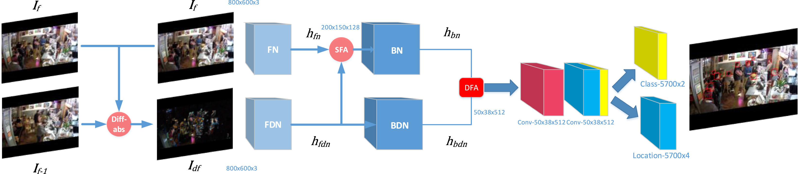

# MPSN
Code for [MPSN: Motion-aware Pseudo Siamese Network for Indoor Video Head Detection](https://www.sciencedirect.com/science/article/pii/S036013232200587X)


 

 [Paper](https://www.sciencedirect.com/science/article/pii/S036013232200587X)

 
## Dependencies
- The code is tested on Ubuntu 20.04.2,python 3.8,cuda 10.1.

- install torch version 

  ```bash
  pip install torch==1.8.0+cu111 torchvision==0.9.0+cu111 torchaudio==0.8.0 -f https://download.pytorch.org/whl/torch_stable.html
  ```

- install cupy, you can install via 

  ```bash
  pip install cupy-cuda101
  ```

## Installation
 1. Install pytorch

 2. Clone this repository
  ```bash
  git clone https://github.com/pl-share/MPSN
  ```
 3. Install 
  ```bash
  pip install -r requirements.txt
  ```
  

## Datasets

- Download the restaurant dataset from the following [link](https://drive.google.com/drive/folders/1EwtLHDjDje7LAScokQqn3UzbHyezKQbS?usp=sharing). Unzip it and store the dataset in the `data/ `folder, You can also change the data set loading path by modifying src/config.py.

- RGBdata_flow.zip : The original and optical flow images

- RGBdata_diff.zip : The original and frame-difference images


## Eval

- Download model from the following [link](https://drive.google.com/drive/folders/14M5tHUYqraaNP2GmxDYGED4ja91pSR2J?usp=sharing).
- Store the head detection model in checkpoints/output/ folder.
- if you want to eval other model,you should modify head_backbone.py simultaneously

```python 
        addnet = right_res()  #line 59
        left_vgg = left_res() #line 60
        in_channel = 256      #mob:96 res:256
```
- Run the following python command from the root folder.

```Bash
python eval.py --model_path <model_path>
```


​	Restaurant datasets model

|        model        | test ap | Anchor scale | pertrained model |
| :-----------------: | :-----: | :----------: | :--------------: |
|  flow mob DFA  |  0.790  |    [2,4]     |       True       |
| diff mob DFA=+|  0.838  |    [2,4]     |       True       |
| diff resnet DFA|  0.802  |    [2,4]     |       True       |
|  diff vgg DFA  |  0.824  |    [8,16]    |       True       |
|diff vgg DFA=+ |0.857|[8,16]|True|

- If you load 'diff vgg DFA+APC',  please modify eval.py

```python
from src.head_detector_vgg16 import Head_Detector_VGG16 #line 14
from trainer import Head_Detector_Trainer   #line 15

head_detector_mpsn = Head_Detector_VGG16(ratios=[1], anchor_scales=[8, 16])    #line 142					
#head_detector_mpsn = mob(ratios=[1], anchor_scales=[2,3])     #line 143
```
- If you choose DFA=+ +APC , please modify train_or.py and head_detector.py simultaneously

```python
#hf2 = t.mul(h1, t.sigmoid(h2)) + h2
hf2 = h1+h2
```
- If backbone is vggnet, please modify trainer.py and head_detector1.py simultaneously

## Training 
```Bash
python train.py
```

## Citation

Please refer to the following bibtex to cite.

```
@article{SUN2022109354,
         title = {MPSN: Motion-aware Pseudo-Siamese Network for indoor video head detection in buildings},
         journal = {Building and Environment},
         volume = {222},
         pages = {109354},
         year = {2022},
         issn = {0360-1323},
         doi = {https://doi.org/10.1016/j.buildenv.2022.109354},
         author = {Kailai Sun and Xiaoteng Ma and Peng Liu and Qianchuan Zhao}
}
```


## Contact Us

If you have other questions❓, please contact us in time 👬

## Acknowledgement

This work builds on the excellent work:
- [FCHD-Fully-Convolutional-Head-Detector](https://github.com/aditya-vora/FCHD-Fully-Convolutional-Head-Detector) by Aditya Vora

